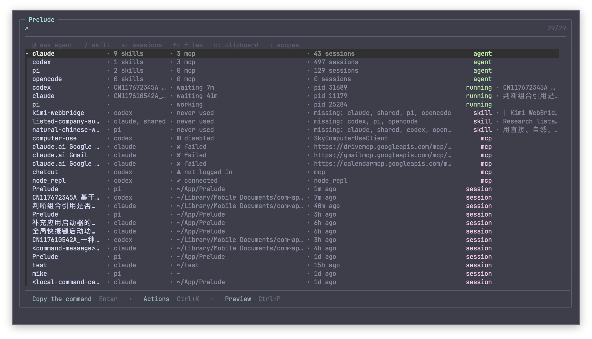

# Prelude

<p align="center">
  <strong>A macOS launcher for terminal work and local coding agents.</strong><br>
  Search what you use, see what your agents are doing, and keep shell commands reviewable.
</p>

<p align="center">
  <a href="#install"><strong>Install</strong></a> ·
  <a href="#how-prelude-is-different"><strong>Why Prelude</strong></a> ·
  <a href="#agent-control-plane"><strong>Agents</strong></a> ·
  <a href="docs/SEARCH.md"><strong>Search guide</strong></a>
</p>



Prelude is a Rust program built on [fzf](https://github.com/junegunn/fzf). It
indexes commands, files, apps, clipboard history, projects, Agent sessions,
Skills, and MCP servers, while keeping large collections behind explicit
scopes. Its gather path has a 40 ms budget.

## Install

```sh
curl -fsSL https://raw.githubusercontent.com/mikewang817/Prelude/main/install.sh | bash
```

The installer supports Apple Silicon and Intel Macs. It downloads the latest
checksum-verified Prelude release, reuses a compatible `fzf` or installs a
private copy, installs the official Ghostty app in `~/Applications` when
needed, adds a managed block to `~/.zshrc`, and installs the global panel as a
LaunchAgent.

On first install, enable Ghostty in **System Settings → Privacy & Security →
Accessibility** when prompted. Prelude checks Ghostty's actual global event-tap
result before reporting the shortcut ready.

- **`Cmd+Shift+Space`** reveals the global panel from anywhere.
- **`Ctrl+R`** opens the inline launcher in zsh shells started after installation.

Run the same installer command again to upgrade or repair the integration.
Check it with `prelude global status`.

## How Prelude is different

Most launchers are organized around applications, files, and web searches.
Prelude includes those objects, but its interaction model is built for shell
commands and coding agents.

| Typical desktop launcher | Prelude |
|---|---|
| Searches apps, files, and links | Also indexes shell history, `$PATH`, project scripts, clipboard objects, sessions, Skills, MCP servers, and live Agent processes |
| Executes a command as soon as it is selected | Hands command text back to the current zsh prompt, or copies it from the global panel |
| Treats results as interchangeable text | Opens files, folders, apps, and URLs directly through macOS while keeping shell commands editable |
| Adds AI as another prompt box | Shows Agent inventory, live state, sessions, capability ownership, MCP health, and waiting questions |
| Integrates with one assistant at a time | Uses one typed registry for Claude Code, Codex, pi, and OpenCode |

There are two surfaces with one result model:

- The **zsh widget** can insert a command or, for an explicit run action, submit
  it to that shell.
- The **global Ghostty panel** has no destination shell. Any command it hands
  over is copied, then the panel closes so you can paste it where you intend.
- External objects act directly on both surfaces. `Enter` states its current
  behavior in the footer; `Ctrl+K` opens the alternatives.

This avoids a launcher guessing which terminal, tab, pane, or working directory
you meant.

## Agent control plane

Prelude manages local Agent facts rather than replacing the Agents themselves.
It currently knows Claude Code, Codex, pi, and OpenCode.

From the launcher you can:

- list installed Agents and every matching process running on the machine
- classify live Runs as working or waiting from process and Session evidence
- answer questions posted with `prelude ask`
- browse and resume native Claude Code, Codex, and pi Sessions
- pin, rename, archive, fork, export, reveal, or safely trash a Session
- merge Skills by name across Agent directories and compare their complete trees
- copy a Skill permanently or prepare a supported one-run loan
- read Claude and Codex MCP status, transport, cached tools, and redacted definitions
- archive Skills and MCP servers in Prelude without changing native Agent files
- inspect the versioned Agent/Run/Session/Skill/MCP graph with `prelude control --json`

Support is capability-specific. For example, Claude and pi can borrow a Skill
for one run; Claude and Codex can borrow an MCP server; OpenCode Sessions are
not currently discovered. Prelude omits an action when the owning CLI has no
known syntax instead of constructing a command that only looks plausible.

The local message bus is file-backed and requires no Prelude server:

```sh
prelude fleet
prelude watch
prelude ask "The migration drops legacy_users. Proceed?"
prelude tell "Migration finished"
prelude say api-gateway "I changed the auth schema; rebase before editing"
prelude inbox --json
```

`ask` waits for an answer on stdout. `say` always leaves a message in the
matched Run's project inbox; it never types into another terminal. Ambiguous
recipients are refused.

## Search

An empty query is a compact Agent home. Type `:` to see every scope.

```text
a:waiting                 Runs or questions waiting for input
s:agent:claude since:24h  recent Claude Code Sessions
s:is:pinned               pinned Sessions
skill:is:archived         archived Skills, ready to restore
mcp:is:archived           archived MCP servers, ready to restore
/cnipa-ooa                run an installed Skill and show its answer
@claude explain this      ask an installed Agent and show its answer
f:tag:work                indexed files carrying a Finder tag
c:                        clipboard text, Finder objects, and images
ql:                       keywords you saved yourself
h:git rebase              recent, filtered shell history
app:zed                   installed applications
10kg to lb                unit conversion
:                         every available scope
```

See [the search guide](docs/SEARCH.md) for the complete query grammar.

## Quicklinks

A Quicklink is a keyword you type to reach one thing. `Ctrl+K` on any file,
folder, application, or URL creates one; `ql:` lists every keyword you have.

```text
notes                     a folder, an app, a file or a URL you named
jira api timeout          a {q} template, with the term filled in
ql:                       browse, rename, re-point or remove them
```

Prelude ships with keywords for general search (`g`, `gh`, `npm`, `mdn`, `gs`,
`b`, `bing`, `ddg`), for looking things up while writing code (`so`, `crates`,
`docsrs`, `pypi`, `pkg`, `caniuse`, `explain`, `hn`), and for working with
agents (`hf`, `arxiv`, `ccdocs`, `mcpdocs`). They arrive in versioned blocks:
one that clashes with a keyword you already use is skipped, and one you delete
stays deleted.

Keywords are matched without regard to case and may be written in any
language. A saved keyword outranks anything Prelude merely found, so it leads
the list well before you finish typing it. Prelude refuses a keyword a scope
command has already spent, refuses to overwrite an existing one, and refuses a
URL that looks like it carries a credential.

```sh
prelude --version                 what you are running, and whether the panel agrees
prelude update --check            is there a newer release
prelude update                    verify the checksum, swap the binary, restart the panel
prelude update --rollback         put the previous binary back
```

```sh
prelude quicklink list
prelude quicklink add notes ~/Documents/notes
prelude quicklink add jira 'https://jira.example.com/issues?jql={q}' Jira
prelude quicklink rename notes n
prelude quicklink check
```

| Key | Action |
|---|---|
| `Enter` | Perform the focused row's stated default |
| `Ctrl+K` | Open contextual actions |
| `Ctrl+P` | Toggle Quick Look when enabled |
| `Cmd+Enter` | Open a file's containing folder from the global panel |
| `→` | Open the focused row's actions, when nothing is typed |
| `←` | Go back one level, when nothing is typed |
| `Escape` | Go back one level; close Prelude at the outermost one |

## Boundaries

- Prelude is macOS-only. The global panel requires Ghostty; the inline launcher
  requires zsh.
- Prelude's own indexes, preferences, clipboard records, capability metadata,
  and message bus stay in its XDG directories. Agent CLIs, MCP checks, web
  searches, and currency conversion use the network only when explicitly asked.
- The update check is the one exception, and it is stated rather than buried:
  at most four times a day, Prelude follows GitHub's `releases/latest`
  redirect to read a version number. It sends nothing about you, carries no
  identifier, and is not an API call. `prelude settings set update off` stops
  that automatic check; `notify` (the default) only tells you, `download`
  stages a verified archive, and `apply` installs it — never mid-session, only
  as the panel next starts. `prelude update` is a request you typed, so it
  works under every setting including `off`.
- Secret-looking history, clipboard text, messages, tags, MCP fields, and
  exported transcripts are filtered or redacted. Complete MCP definitions are
  not retained in ordinary Items or caches.
- File, application, Skill-copy, and inactive-Session removal goes through the
  Trash. Irreversible process termination confirms first.
- A failed source degrades to an empty or cached result instead of blocking the
  launcher indefinitely.

## Documentation

- [Search scopes and query grammar](docs/SEARCH.md)
- [Defaults, actions, and safety](docs/ACTIONS.md)
- [Global panel architecture and lifecycle](docs/GLOBAL-HOTKEY.md)
- [Agent control plane model and support matrix](docs/AGENT-CONTROL-PLANE.md)
- [Build from source and contribute](CONTRIBUTING.md)

Prelude is licensed under [Apache-2.0](LICENSE).
